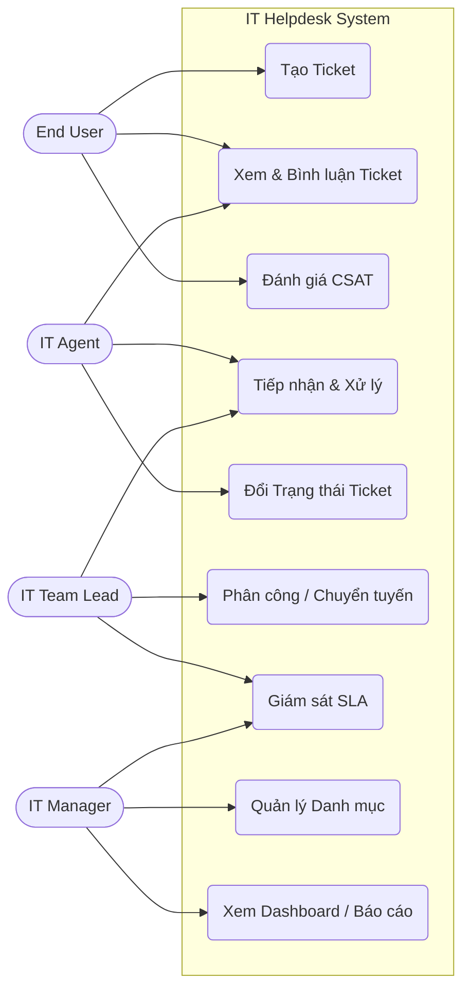
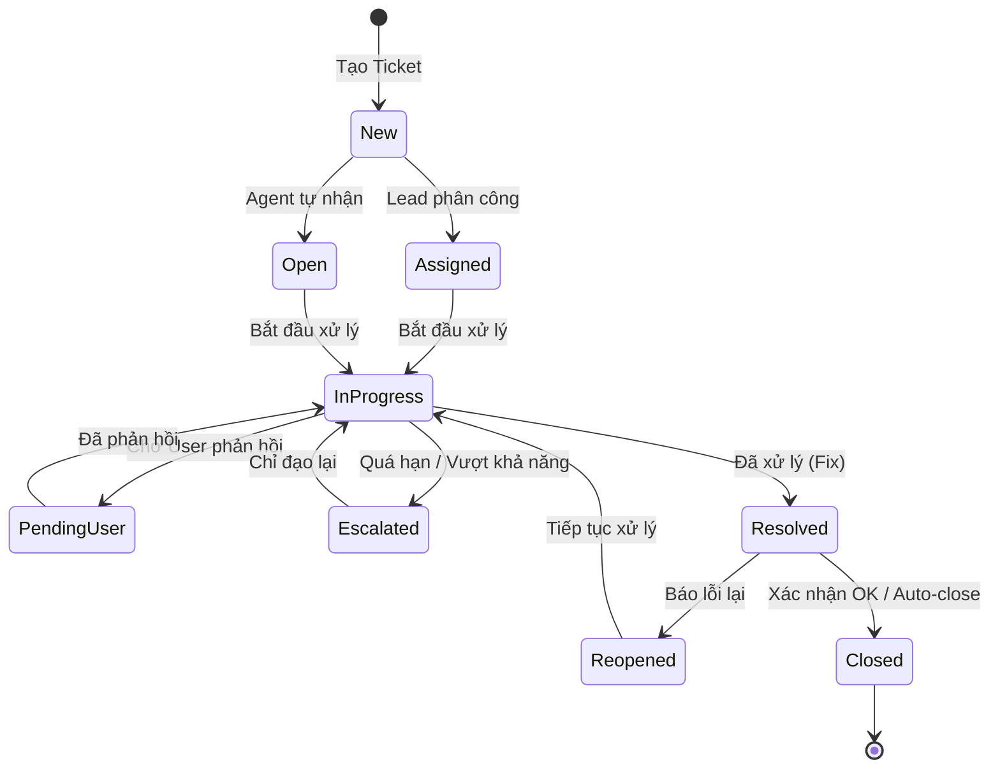
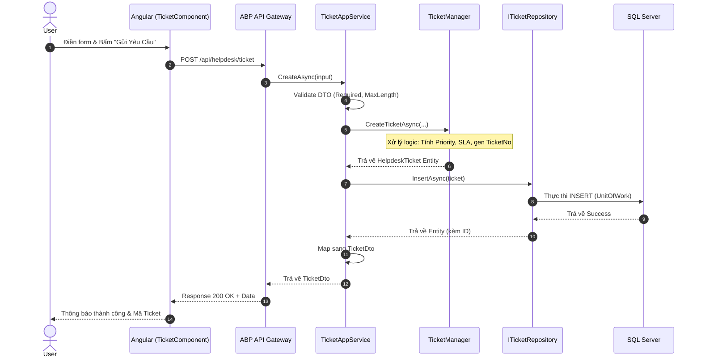
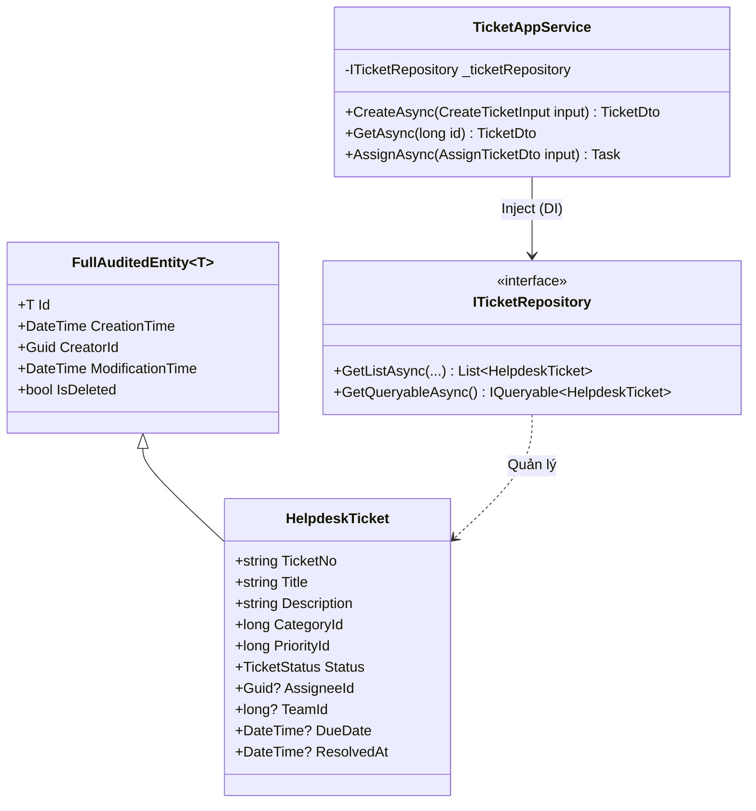
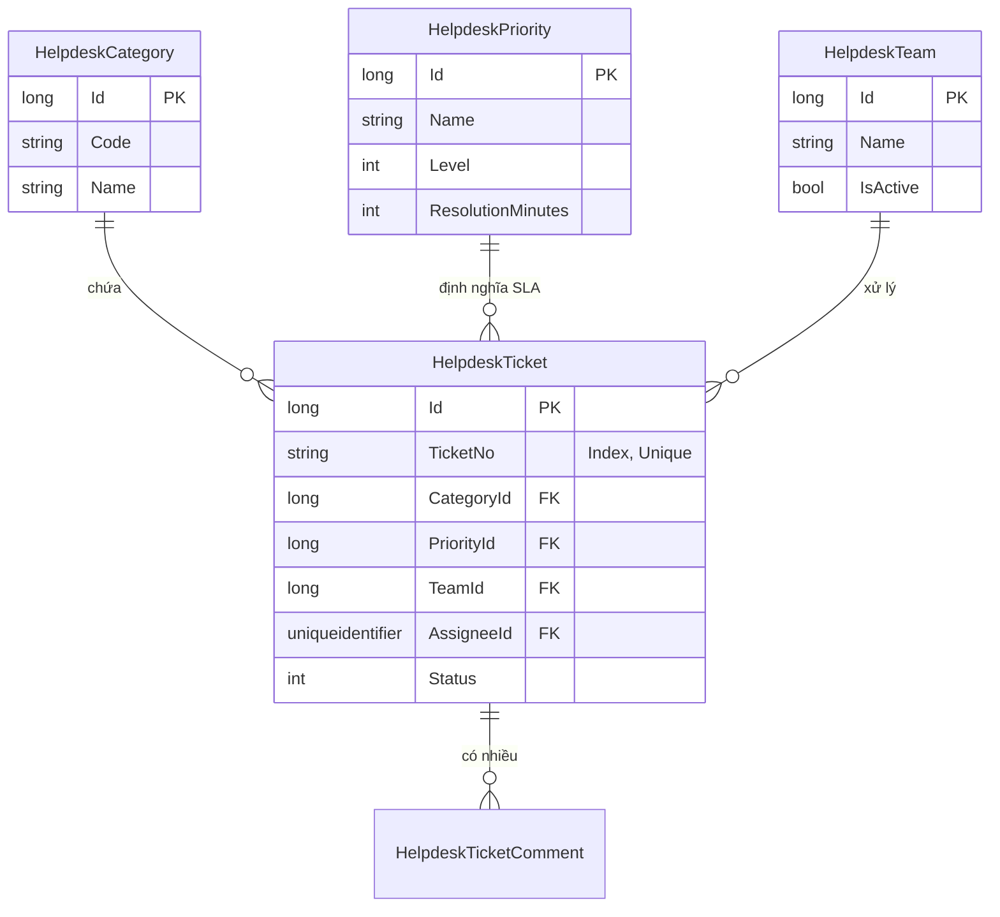

# Phân Tích Hệ Thống Quản Lý Yêu Cầu Hỗ Trợ IT (IT Helpdesk)

Tài liệu này bao gồm các sơ đồ phân tích hệ thống IT Helpdesk, tuân thủ nghiêm ngặt quy chuẩn Coding Convention ABP .NET + Angular.

## 1. Sơ đồ Use Case (Use Case Diagram)

## 2. Sơ đồ Nghiệp vụ (Business Flow Diagram)

## 3. Sơ đồ Tuần tự (Sequence Diagram)

## 4. Sơ đồ Lớp (Class Diagram)

## 5. Sơ đồ ERD (Database Diagram)

